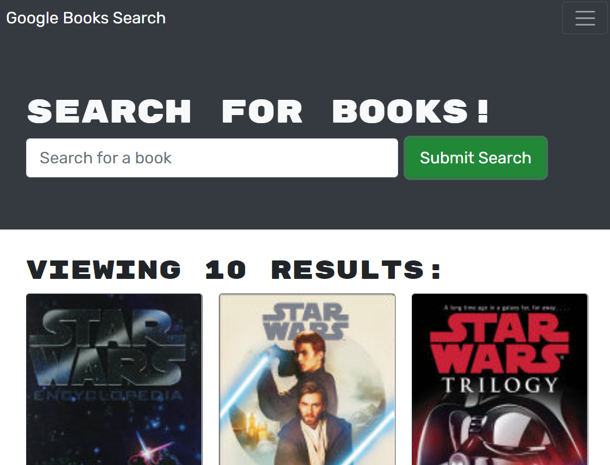

# Book Search Engine

## Description
Provided with fully functioning Google Books API search engine built with a RESTful API. Refactored code to be a GraphQL API built with Apollo Server. The app was built using the MERN stack, with a React front end, MongoDB database, and Node.js/Express.js server and API. 

[Deployed on Heroku](https://arcane-river-36262.herokuapp.com/)

## Questions
[emilyadarr](https://github.com/emilyadarr)
<emilyadarr@gmail.com>
